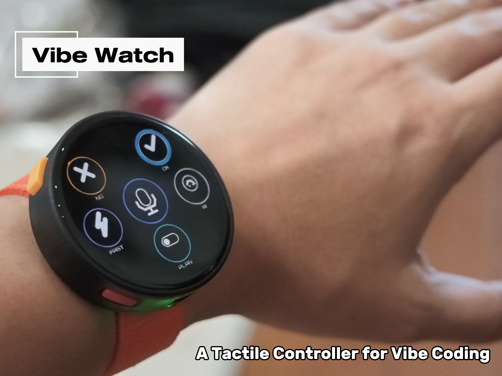
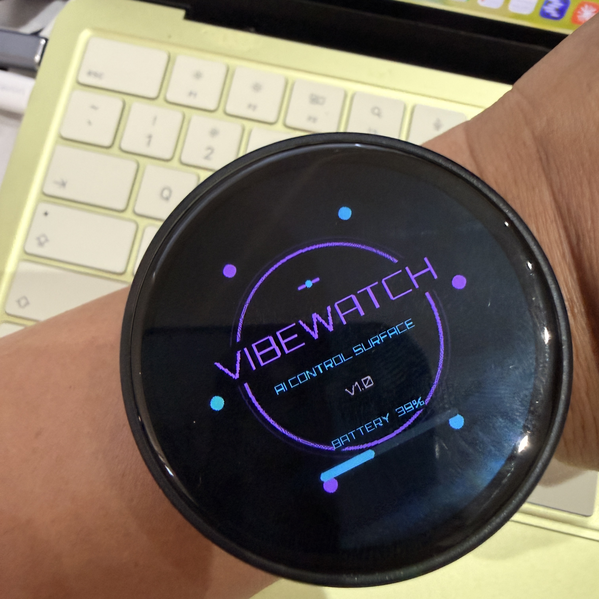
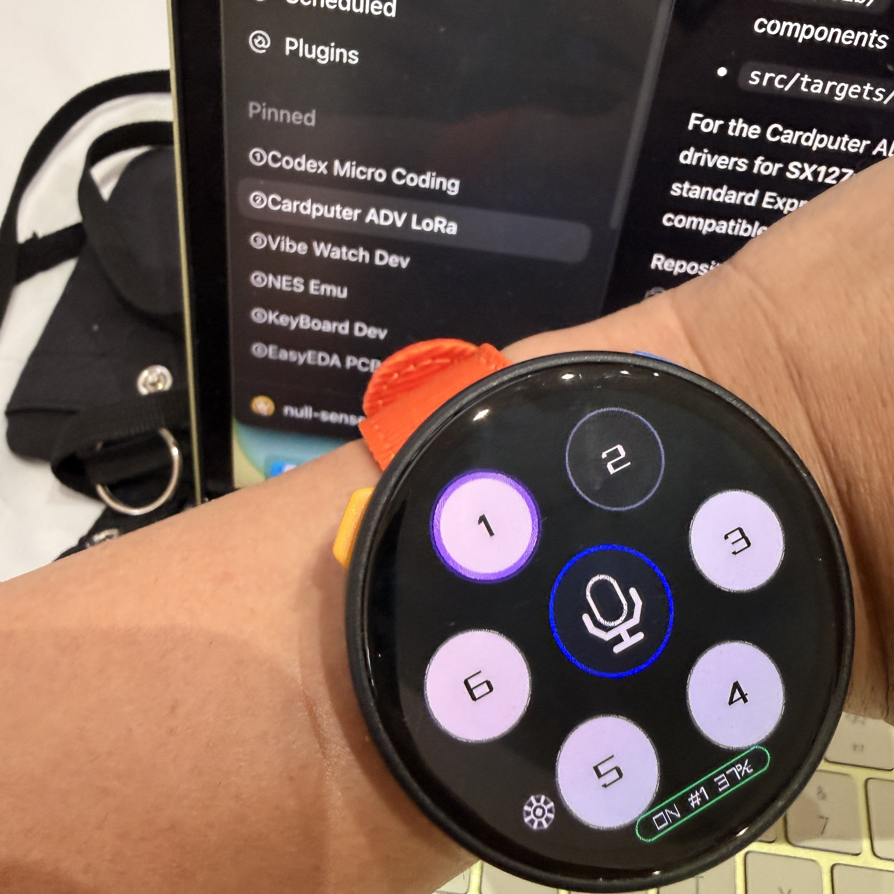
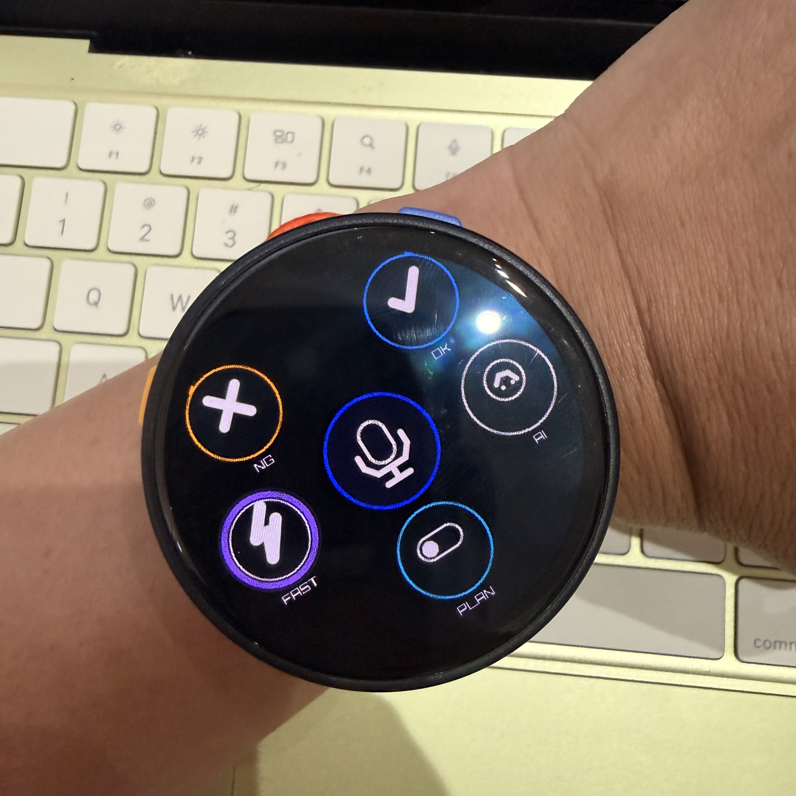
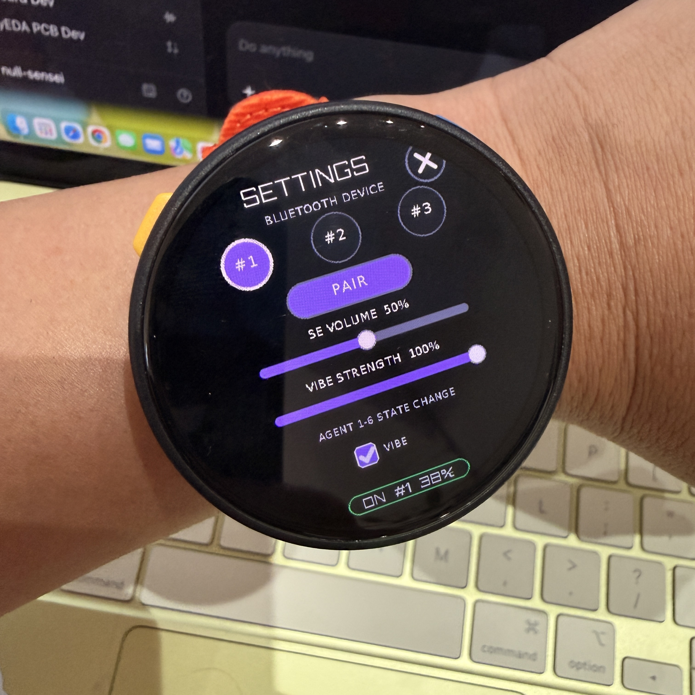
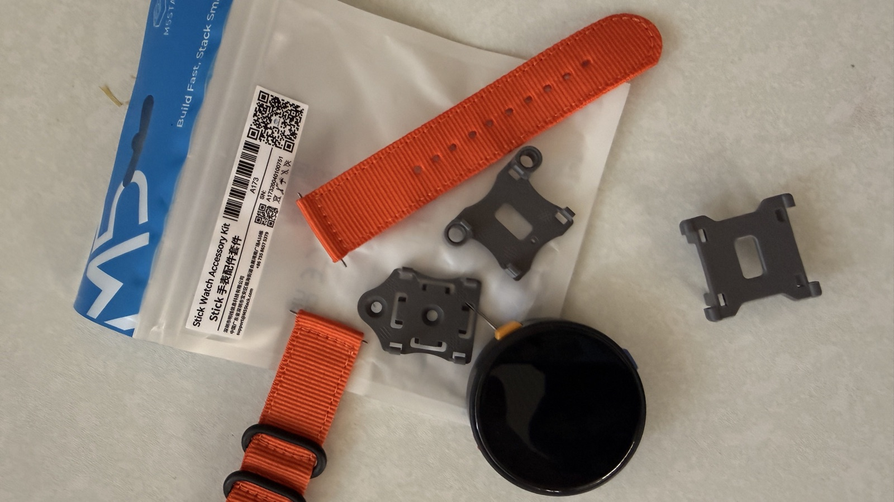
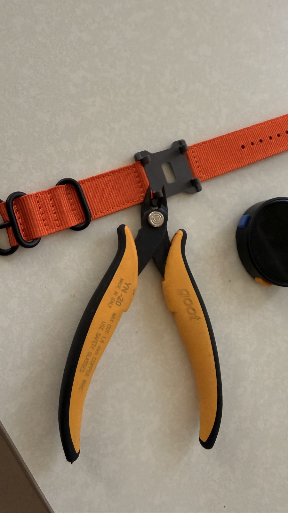
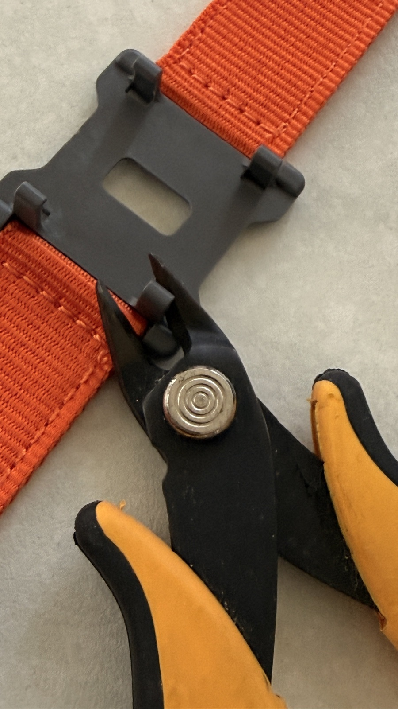
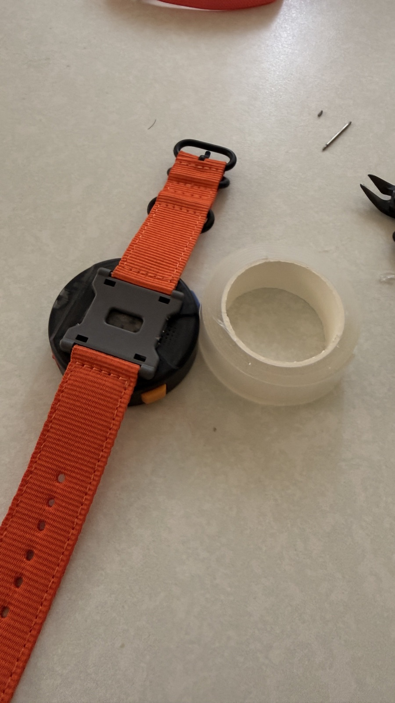

# Vibe Watch

[English](README.md) | **日本語** | [简体中文](README.zh-CN.md)

[](https://github.com/GOROman/vibewatch/actions/workflows/firmware.yml)

**M5Stack StopWatchを中心に作った、AI支援Vibe Codingのためのウェアラブルな触覚コントロールサーフェス。**

[M5Stack Global Innovation Contest 2026](https://m5stack.com/global-innovation-contest-2026)応募作品です。



## ひと目で確認、ひと押しで操作、フローを止めない

Vibe Watchは、頻繁に使うAIエージェント操作を混雑したデスクトップUIから専用ワイヤレスデバイスへ移します。6つのエージェント状態をひと目で把握し、承認・拒否を物理操作で判断でき、Planモード、AI呼び出し、Push-to-Talkを手首から利用できます。

目的はシンプルです。AIを操作するために使う注意を減らし、AIと一緒に創ることへ集中します。

## 制作の動機

Vibe Codingでは、複数のAIエージェントセッションを同時並行で扱うことが当たり前になりました。そこで新しい操作上の課題が生まれます。どのタスクが終了したかを瞬時に把握し、正しいセッションを選び、ウィンドウを探したりキーボードへ戻ったりせず、次のプロンプトを音声で入力したいと考えました。

[OpenAI Codex Micro](https://learn.chatgpt.com/docs/features/codex-micro)を購入し、AIコーディング専用ハードウェアという考え方に刺激を受けました。円形画面、直接操作、モーション、サウンド、触覚、音声入力を組み合わせれば、さらに小さく、ひと目で分かり、表情豊かな体験を作れると考えました。こうして、並列セッションのためのウェアラブルなAIコックピット、Vibe Watchが生まれました。

## 体験

メインの**エージェントレイヤー**では、円形画面の周囲に6つのエージェントを配置します。ホストから受け取った色、明るさ、アニメーションで状態を伝え、素早いスプリングモーションで選択リングが次のエージェントへ移動します。

2つの物理ボタンを同時に押すと、UIが**アクションレイヤー**へ変形します。

| 操作 | 体験 |
|---|---|
| **FAST** | クイックアクションを実行 |
| **NG / OK** | 異なる矩形波SEと振動で拒否・承認 |
| **PLAN** | 表示状態を伴うPlanモード切り替え |
| **AI** | AIアシスタントを呼び出し |
| **中央マイク** | 長押しによる音声入力 |

左のオレンジボタンはNG、右の青ボタンはOKに対応します。物理ボタンから画面上の操作へ色付きのラインをつなぎ、説明を読まなくても関係が理解できるようにしました。

## インターフェースギャラリー

<table>
  <tr>
    <td width="50%" valign="top"><br><strong>製品らしい起動体験</strong><br>フェードインするロゴ、オリジナルジングル、実測バッテリー残量。</td>
    <td width="50%" valign="top"><br><strong>6つの並列エージェント</strong><br>作業画面を隠さず、状態と選択を常に確認できます。</td>
  </tr>
  <tr>
    <td width="50%" valign="top"><br><strong>アクションレイヤー</strong><br>FAST、NG、OK、PLAN、AI、音声入力を手首から即座に操作できます。</td>
    <td width="50%" valign="top"><br><strong>デバイス内設定</strong><br>ペアリング、SE音量、振動強度、状態変化時の振動を本体で設定できます。</td>
  </tr>
</table>

## 一体化したマルチセンサリーUI

Vibe Watchは、装飾的な画面を付けたマクロパッドではありません。映像、動き、音、振動、タッチ、物理ボタンのすべてが同じ操作状態を伝えます。

- **OK**は上昇する矩形波、**NG**は下降する矩形波で確認できます。
- ペアリング成功は音と振動の両方で知らせます。
- エージェント状態の変化は、調整可能な振動だけで静かに通知できます。
- SE音量、振動強度、状態変化時の振動は本体で設定でき、再起動後も保持されます。

## M5Stackコントローラーの活用

M5Stack StopWatchは、別のコントローラーに接続した受動的な画面ではなく、製品の完全なユーザーインターフェースです。

- **ESP32-S3**がUI、設定保存、バッテリー監視、Bluetooth Low Energy HID通信を実行します。
- **466 × 466の円形タッチスクリーン**が6エージェントの空間UIとアクション操作を表示します。
- 2つの**物理ボタン**で、画面を見ずに移動や承認・拒否ができます。
- 内蔵**スピーカー**と**振動モーター**が即座に識別できるフィードバックを返します。
- 内蔵**バッテリー**により、ワイヤレスで持ち運べます。

この密接なハードウェア統合により、市販のM5Stackコントローラーを専用のヒューマンAIインターフェースへ変えました。

## StopWatchから腕時計へ

公式の[Watch Accessory Kit for M5Stick Series](https://shop.m5stack.com/products/watch-accessory-kit-for-m5stick-series)を腕時計マウントとして転用しました。このキットは矩形のM5Stick向けなので、丸いStopWatchへ取り付ける前にWatch Mount Accessoryを少し加工します。

1. 加工前にプラスチックマウントをデバイスとストラップから外します。
2. ニッパーでM5Stick固定用の突起を少しずつ切り落とします。
3. バリや鋭い部分を整え、接着面を平らにします。
4. マウントとStopWatch背面を清掃し、完全に乾かします。
5. 強力両面テープをマウント内に収まる大きさへ切り、ボタン、端子、開口部を避けます。
6. StopWatch背面の中央へマウントを合わせて強く圧着し、指定された接着時間を待ちます。
7. ナイロンストラップを戻し、装着前に十分な引っ張りテストを行います。

### 腕時計マウントの加工写真

<table>
  <tr>
    <td width="50%" valign="top"><br><strong>1. マウントを選ぶ</strong><br>公式キットに付属する矩形のWatch Mount Accessoryを使用します。</td>
    <td width="50%" valign="top"><br><strong>2. 固定用突起を切る</strong><br>小型ニッパーでM5Stick固定用の突起を1つずつ慎重に切ります。</td>
  </tr>
  <tr>
    <td width="50%" valign="top"><br><strong>3. 接着面を平らにする</strong><br>残ったプラスチックと鋭い部分を整えます。</td>
    <td width="50%" valign="top"><br><strong>4. 圧着して確認する</strong><br>強力両面テープで中央へ固定し、装着前に引っ張りテストを行います。</td>
  </tr>
</table>

StopWatch本体のケースを加工せず、キット部品と両面テープだけでウェアラブル化できます。机の前だけでなく、移動中もインターフェースをすぐ使えます。

## 効果と有用性

Vibe Watchは、AI支援作業で何度も発生する小さな中断を減らします。複数エージェントの動きを常時確認し、承認を確実な物理操作に変え、キーボードから離れていても音声入力をすぐ始められます。

この操作モデルは、コーディングだけでなく、アクセシビリティ支援、クリエイティブアプリ、マルチエージェント運用など、画面領域より注意力が重要な作業へ拡張できます。

## 使用ハードウェア

| 項目 | 数量 | 役割 |
|---|---:|---|
| [M5Stack StopWatch](https://docs.m5stack.com/en/core/StopWatch) | 1 | コントローラー、表示、入力、音、振動、BLE、電源 |
| [M5Stack Watch Accessory Kit for M5Stick Series](https://shop.m5stack.com/products/watch-accessory-kit-for-m5stick-series) | 1 | ナイロンストラップと加工するWatch Mount Accessory |
| 強力両面テープ | 1片 | 加工したマウントをStopWatchへ固定 |
| Bluetooth対応macOSコンピューター | 1 | AIコーディングのホスト |

腕時計化に使う工具：ニッパー、必要に応じて細目ヤスリ、保護メガネ。

## ビルドとペアリング

[PlatformIO Core](https://docs.platformio.org/en/latest/core/installation/index.html)をインストールし、公開リポジトリをcloneしてビルドします。

```sh
git clone https://github.com/GOROman/vibewatch.git
cd vibewatch
python3 -m platformio run -e m5stack-stopwatch
```

StopWatchを接続して書き込みます。

```sh
python3 -m platformio run -e m5stack-stopwatch --target upload
```

Vibe WatchでSettingsを開き、3つのデバイススロットから1つを選び、**PAIR**をタップしてmacOSのBluetooth設定から`Vibe Watch #n`へ接続します。

## ライセンス

[MIT License](LICENSE)

## 参考資料

- [M5Stack StopWatch — 公式ドキュメント](https://docs.m5stack.com/en/core/StopWatch)
- [M5Stack Watch Accessory Kit for M5Stick Series — 公式製品ページ](https://shop.m5stack.com/products/watch-accessory-kit-for-m5stick-series)
- [OpenAI Codex Micro — 公式ドキュメント](https://learn.chatgpt.com/docs/features/codex-micro)
